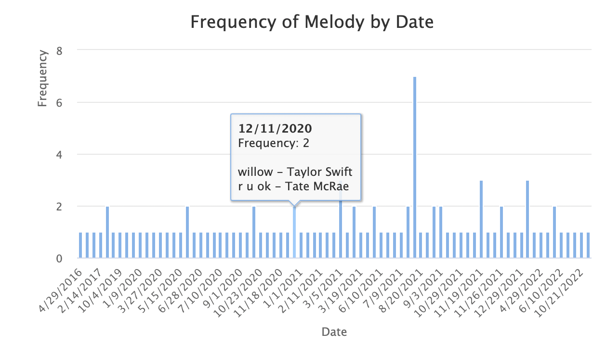
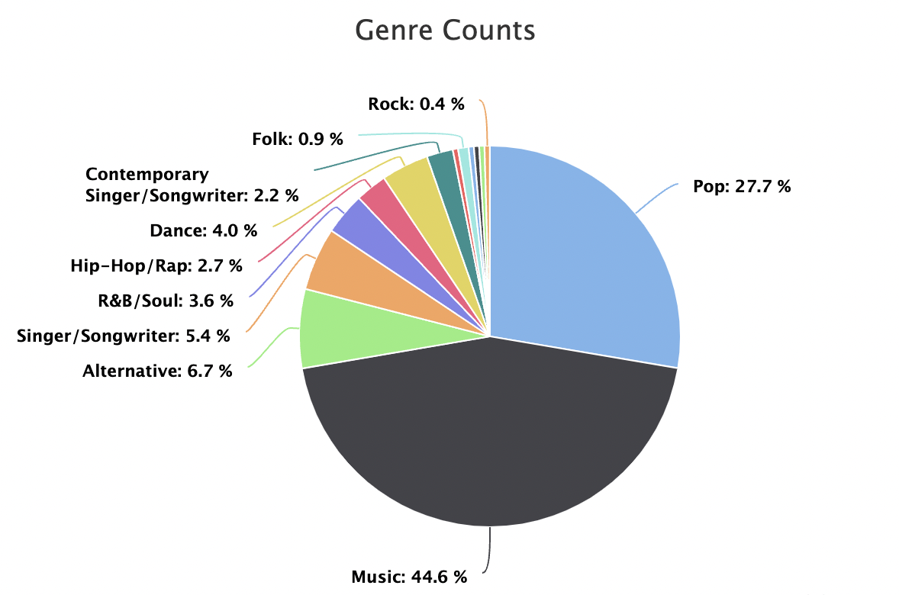
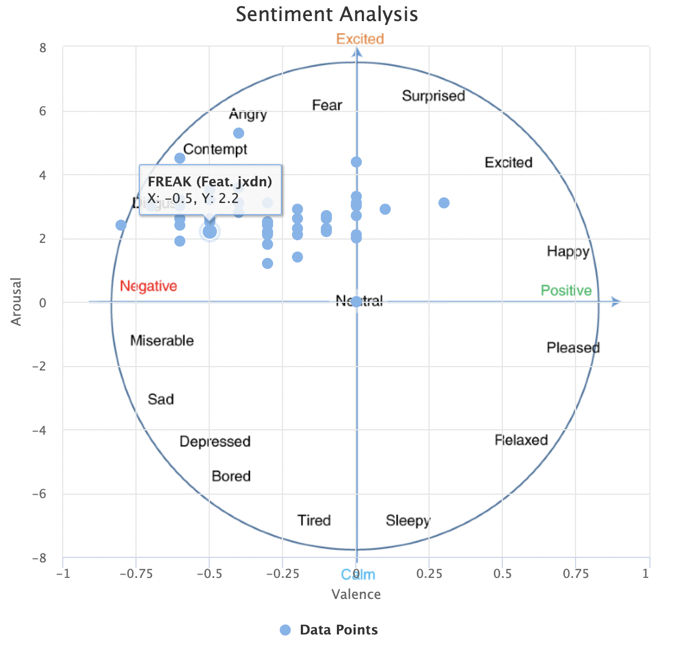

# Media Data Visualization Framework

## Brief Overview

The idea of the framework is to perform data visualization and sentiment analysis on media data from different sources including music, video, and social media (provided by data plugins), and show results in different ways (using visualization plugins).

Media data will be obtained from different data sources. Data plugins will deal with different data sources respectively and transform raw data into a generic format for the framework. In the framework, we use an open-source machine-learning APIs to perform sentiment analysis on textual media data. The framework is able to performs the sentiment analysis on any kinds of text data, hence providing benefits for reuse. Further reuse benefits come from being able to reuse existing visualizations when just providing a new data plugin or vice versa.

Data plugins should fetch data from the source and return a list of Track object. Each Track object contains the following fields: title (track name), artist (artist name), genre (genres of the track), timestamp (the time the track was added to the collection), and sentiment score (have two double values - intensity and positive vs negative).

Data plugins include:

- Spotify Plugin: collects specific playlist data such as Classic Music Playlist as well as their songs' data like name, genre, artist, etc. using the Spotify Web API.
- Apple Music Plugin: retrieves specific playlist data such as Rock & Roll Music Playlist as well as specific music data like name, genre, artist, etc. using the Apple Music API.
- Vimeo Plugin: enables users to extract their likelist data from Vimeo as well as specific video data like name, categories, author, etc. using Vimeo Developer API.

The framework takes in a list of Track objects, and then perform sentiment analysis on the textual data (e.g., lyrics for music, and description for video). The framework sends the list of updated Track objects to visualization plugins. Visualization plugins should take in a list of Track objects and return a display result.

Display plugins could include:

- Frequency Plugin: The Frequency Plugin displays the frequency of the media on each day with a bar chart. By hovering over the bar, you can see the details including a list of titles of the media and artists.

  Example: 

- Genre Plugin: The Genre Plugin displays the distribution of the genres of the media with a pie chart. You can see the name of the genre and the percentage shown next to the colored section. By hovering over each section, you can also see a list of titles that fall into that genre.

  Example: 

- Sentiment Plugin: The Sentiment Plugin displays the sentiment analysis on the textual content of the media with a two dimensional scatter plot. The x axis shows the arousal and the y axis shows the valence. By hovering over each dot, you can see the actual arousal and valence value and the title of the media.

  Example: 

## How to get Credentials

Go to the directory `backend/src/main/java/edu/cmu/cs/cs214/credentials.json` and find a file named `credentials.json`. You can see the following fields. You can put your own credentials in the file if you want. But we have already put our credentials in the file for your convenience. You can use those credentials to run the program. Please do not spread the credentials to others. You can create your own credentials following the steps below.

```
{
  "spotifyClientId": "",
  "spotifyClientSecret": "",
  "appleMusicPrivateKey": "",
  "appleMusicKeyId": "",
  "appleMusicTeamId": "",
  "musixmatchApiKey": "",
  "vimeoClientId": "",
  "vimeoDefaultAccessToken": ""
}
```

### Spotify API Key

1. Go to https://developer.spotify.com/.
2. Login in or sign up and your Spotify developer account.
3. Navigate to dashboard and create your project.
4. Go to settings and find your Client ID and Client Secret.
5. Put them in `"spotifyClientId"` and `"spotifyClientSecret"` fields in `credentials.json`.

Note that we are using Client Credentials Flow to authenticate our requests. This flow is not able to request a user's private data. For more information, so some private playlist may not be access in our setting. please refer to https://developer.spotify.com/documentation/general/guides/authorization-guide/.

### Apple Music API Key

1. Go to https://developer.apple.com/.
2. Login in or sign up and your Apple account, you will need to enroll in Apple Developer Program for the next steps.
3. Navigate to `"Certificates, Identifiers & Profiles"` and select `"Identifiers"`.
4. Select `"MusicKit"` and create your MusicKit Identifier.
5. Navigate to `Keys` section, and fill out the required information and enable `"MusicKit"` in the `"Key Services"`.
6. Download the private key (.p8 file) and store it securely.
7. Navigate to `Membership` section, find your Team ID.
8. Put the private key (.p8 file) in `"appleMusicPrivateKey"`, key ID in `"appleMusicKeyId"`, and Team ID in `"appleMusicTeamId"` fields in `credentials.json`.

You can use Apple Music API to access information about media in the Apple Music Catalog and your personal iCloud Music Library. Please find more information at https://developer.apple.com/documentation/applemusicapi/.

### Musixmatch API Key

1. Go to https://developer.musixmatch.com/.
2. Login in or sign up and your Musixmatch developer account.
3. Navigate to `Dashboard` and find `Application` section.
4. Put your API Key in `"musixmatchApiKey"` field in `credentials.json`.

Note that there's a 2,000 API calls daily limit for the free plan. Please refer to https://developer.musixmatch.com/plans for more information. If you see `JSONObject["body"] is not a JSONObject.` error, it likely means you have reached the daily limit.

### Google Cloud Natural Language API Key

1. Go to https://cloud.google.com/natural-language/.
2. Login in or sign up and your Google Cloud Platform account.
3. Navigate to GCP Console and create a new project.
4. Find `Cloud Natural Language API` and click "Enable" to activate the API for your project.
5. In the `Keys` tab, click `Add Key` and select `JSON` as the key type. Downloaded the generated key to your computer.
6. Put the private key (.json file) in our codebase.

Note that our provided key is under `/hw6-analytics-framework-the-band/backend/src/main/java/edu/cmu/cs/cs214/` and called `sentimentConfig.json`.

### Vimeo API Key

For Vimeo, the api request is to get the user like list, which is the list of videos the user has clicked 'like'.

To use the api key of Vimeo, you should register your own app on [My Apps](https://developer.vimeo.com/apps) and generate a public && private access token.

1. Go to the [My Apps](https://developer.vimeo.com/apps) page.
2. Click Create an app. Your browser goes to the Create a New App page.
3. In the App name field, type the name of your app. In the App description field, type a brief description of your app. This text appears in the authorization prompt, which your end users receive when your app requests permission to access their Vimeo account.
   Set the access permissions to your app let under other Vimeo accounts can access your app.
4. After creating App, click the name of your app. Your browser goes to this app's information page.
5. In the navigation list on the left side of the page, click Generate an access token, or just scroll down the page to this section.
6. To access your private data, select the Authenticated option. This generates the Scopes section, which offers various capabilities. You must check the private capability to proceed. If you don't select a token type, your token defaults to Unauthenticated, which is public.
7. Put the client id from app's information page in `vimeoClientId` and the newly generated access token in `vimeoDefaultAccessToken` in `credentials.json`.

Vimeo provides three methods for obtaining access tokens, one of which involves interacting with a browser. In this approach, you log in to your Vimeo account and grant the plugin permission to access your private data, such as playlists. Subsequently, a temporary access token is generated, granting the plugin the necessary privileges. However, this method's success may vary depending on the browser version, and it may not always work as expected.

## How to Run

### Set up backend server

You can open the backend folder using the IDE of your preference. Then click on the green button next to the `main()` method in `App.java`.

Or you can run using command line. Go to the backend folder and run backend using command line.

```
cd backend
mvn clean install
mvn exec:exec
```

This will start the Java server at http://localhost:8080.

### Set up frontend server

Go to the `frontend` folder and run

```
cd frontend
npm install
```

Then you should see the `node_modules` folder within the `frontend` folder.

Then run the command to start frontend server.

```
npm run start
```

This will start the frontend server at http://localhost:3000.

## User Interface

The interface is designed to be intuitive and simple to interact with. There are four stages, selecting data source, entering access token, selecting visualization type, and show visualization respectively. By clicking the next button, you can move to the next stage. By clicking the restart button, you can go back to the initial stage. At each step you can select the configuration you'd like to apply to the visualization. Please note that `Retrieve token by browser` is only available for Vimeo, not available for Apple Music and Spotify.

Please be patient after clicking the Next button at the selecting visualization type stage as it could take a while for the server to fetch data from external API. Meanwhile please do not do any operations on the interface. After the visualization is loaded, feel free to hover over the chart to see the tooltip with more detailed information like the titles and artists of the track/video that falls into the specific category.

## How to Extend

### Framework and Data Structure

The framework is designed to obtain media data from various sources, including media platforms, through specific playlists. The obtained media data is then transformed into a generic format and analyzed using open-source machine learning APIs for sentiment analysis. The framework is capable of analyzing different types of textual media data, such as lyrics for music and descriptions for videos.

After the media data plugins fetch the unified data, the framework performs processing and analyze and then send the data to display plugins, which are responsible for presenting the analyzed results in different visual formats. The display plugins render the analyzed data into various visualizations, such as the Frequency Plugin, which shows the frequency of tracks by date.

### Extend Data Plugins

The framework's extensibility is demonstrated by its ability to integrate new data plugins and display plugins. All data plugins are recorded in the backend/src/main/resources/META-INF/services/edu.cmu.cs.cs214.dataPlugins.DataPlugin file, and the app loads all data plugins at the beginning of the system. New data plugins can be easily added by adding the class name in the backend/src/main/resources/META-INF/services/edu.cmu.cs.cs214.dataPlugins.DataPlugin file and adding the class implementation in the dataPlugins package. New data plugins can be added to the framework to fetch media data from different sources and transform them into a generic format that can be analyzed by the framework's sentiment analysis module. For instance, a data plugin for extracting media data from a social media platform like Twitter or Instagram from the use's like list could be easily integrated into the framework.

### Extend Visualization Plugins

Similarly, new display plugins can be developed to present the analyzed data in different visual forms. For example, a new display plugin could be developed to represent the authors of each track data in different graphs. All display plugins are implemented under the src/displayPlugins directory and the names are stored in the displayPlugins.txt file under the public directory. To add a new display plugin, simply add the name to the displayPlugins.txt file with a new line at the end and add the plugin implementation in a new tsx file under src/displayPlugins. The plugin will be automatically loaded in App.tsx. The framework's modular design and extensibility make it a powerful tool for analyzing and visualizing media data from various sources. Its ability to easily integrate new data and visualization plugins ensures that it can adapt to new sources of media data and changing data analysis needs.

## Data Processing

We use the Google Cloud Natural Language API (https://cloud.google.com/natural-language) for implementing our sentiment analysis method, which determines the overall sentiment (positive, negative, or neutral) expressed in a piece of text. Our implementation leverages this API to analyze the sentiment of a textual media data. By using the Analyze class, developers can easily reuse and integrate sentiment analysis into their applications, providing valuable insights into the emotional tone of the content.
