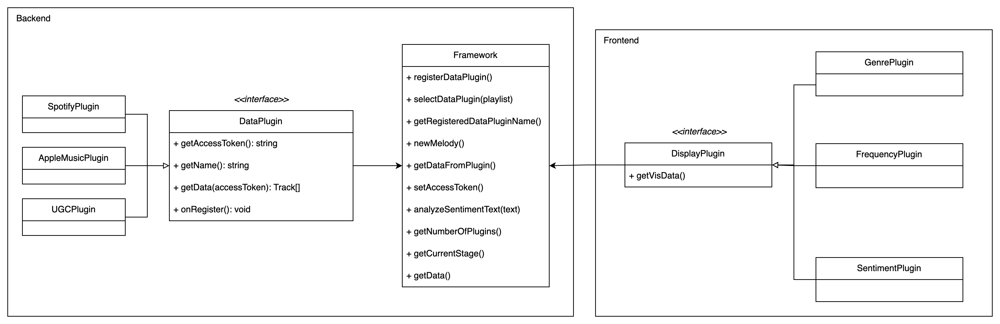

## Melody Analysis Framework

### Domain

Our framework aims to analyze specific playlist data from various media platforms. The framework performs comprehensive analysis and aggregation on data from different sources (provided by data plugins). After analysis, the framework visualizes the results in various ways. This framework is designed to work with a range of data and display plugins, enabling users to assess their playlist history in a visually engaging and informative manner.

The framework collects specific playlist data (e.g. play timestamps) and corresponding media data (e.g. name, genres, artists) from different media platforms using official APIs by data plugins. Then aggregates timestamp in same day/month and performs analysis on the collected data with offline machine learning APIs to generate analysis like frequency analysis, sentiment analysis, personality analysis and taste analysis. Specially, to do sentiment analysis, the framework can get the lyrics of the songs from Musixmatch or the description of the videos and generate analysis with APIs like `Google Cloud`. The output of analysis will be shown by display plugins.

Data plugins provide . Some examples of data plugins include:

- Spotify plugin collects specific playlist data such as Classic Music Playlist as well as their songs' data like name, genre, artist, etc. using the Spotify Web API.
- Apple Music plugin retrieves specific playlist data such as Rock & Roll Music Playlist as well as specific music data like name, genre, artist, etc. using the Apple Music API.
- The Vimeo Plugin enables users to extract their likelist data from Vimeo as well as specific video data like name, categories, author, etc. using Vimeo Developer API.

Display plugins consume analysis output and playlist data, displaying the results in various formats. Some examples of visualization plugins include:

- Time Series Graph as well as heat map displays playlist data in a time series graph similar to GitHub commit history, allowing users to observe patterns, trends and frequencies in media playlist curation.
- Pie chart visualizes the genres of the media data in the playlist and their occurrence times, providing an overview of genre distribution, to generate a sentiment analysis as well as personality analysis of that user based on the genre distribution.

The framework's modular design, which includes support for various data and visualization plugins, provides several benefits that make reuse plausible and useful:

1. Flexibility: The framework can be easily extended and customized to accommodate new data sources. Users can create or integrate additional data and visualization plugins to analyze different aspects of music data or incorporate other media platforms.
2. Scalability: The modular nature of the framework allows users to add or replace data and visualization plugins without affecting the core functionality. This adaptability ensures that the framework can grow and evolve with changing user requirements and advances in media data analysis techniques.
3. Reusability: Users can reuse existing visualizations when providing a new data plugin or vice versa, which reduces the need for redundant work and helps maintain consistency in the presentation of media data analysis results.

### Generality vs specificity

In designing this music data analysis and visualization framework, there are several trade-offs to consider in terms of generality and specificity. To achieve the desired balance between reusability and domain-specific functionality, we consider the following:

1. **Identify core abstractions and define the interfaces:**

   Begin by identifying the key abstractions that will form the core of the framework. For data plugins and display plugins, their interfaces should be designed to be generic enough to support various data sources and visualizations while still being focused on the music data domain. In this case, our data plugin interface contains getAccessToken(), fetchProfile(), getUserId(), getUserPlaylist(); the display plugin interface contains getVisData(). The interfaces are defined with a set of common methods that all implementations must follow. This will ensure that all plugins are interchangeable and can work with the framework seamlessly.

2. **Reusable functionality in framework:**

   We plan to implement reusable functionality in the framework that can be used by all plugins. This can include methods for data manipulation, error handling, sentiment analysis or other machine learning components, etc. By centralizing these functionalities, we can ensure that all plugins can benefit from it, improving maintainability and reusability.

3. **Encapsulate domain-specific logic:**

   The domain-specific logic should be encapsulated, such as handling Spotify or Apple Music API calls, within the respective data plugins. Similarly, encapsulate the visualization logic, such as generating word clouds, pie charts, or time series graphs, within the respective display plugins. By doing this, we keep the core framework generic and reusable, while still providing different functionality within the specific plugins.

4. **Enable extensibility:**

   We want to design the framework to be extensible so that new plugins can be easily added or existing plugins can be modified. This can be achieved by using dependency injection, allowing users to register new plugins at runtime, and using a modular architecture. By making the framework extensible, we hope it could adapt to new requirements and data sources in the future.

5. **Reusability within plugins:**

   The data format for data plugins or display plugins is the same. In this way, say a display plugin that generates pie charts could have a reusable PieChart component that can be used with different datasets. This not only promotes reusability within the framework but also helps maintain consistency in the visualizations.

### Project Structure

Our application utilizes a delegation-based framework to support various data and visualization plugins, enabling a flexible and extensible data-driven solution. The framework integrates with diverse data plugins for sourcing information and visualization plugins for different techniques. Through delegation, we separate the core framework from individual plugins, allowing independent development and improved modularity.

We have organized our project structure into the following components:

#### Backend

- The core package: It contains the framework classes and interfaces responsible for managing plugins, the communication between plugins and the framework, and the data processing implemented in the framework.
- The gui package: It contains the MelodyState to be sent to the frontend to communicate with the display plugins.
- The dataPlugins package: It holds multiple data plugins that are responsible for retrieving and processing data from various sources. DataPlugin is the plugin interface that specifies the required methods and properties that all plugins must implement.

Data plugins are registered and loaded in `App.java`. The `loadPlugin` method utilizes Java's ServiceLoader to discover and load available data and visualization plugins. Plugin registration is handled by creating a ` META-INF/services` directory in source folder, containing files named according to the fully-qualified plugin interface names.

Our backend file structures are as follows:

```
- resources/META-INF/services
	- edu.cmu.cs.cs214.hw6.framework.core.MusicPlugin
- java/edu/cmu/cs/cs214
	- core
		- MelodyFramework.java
		- Analyze.java
		- Stage.java
	- gui
		- MelodyData.java
		- Plugin.java
	- dataPlugins
		- DataPlugin.java
		- SpotifyPlugin.java
		- AppleMusicPlugin.java
		- VimeoPlugin.java
		- LyricsFetcher.java
		- Track.java
	- App.java
```

#### Frontend

The displayPlugins folder holds multiple display plugins that create different types of visual representations for various aspects of melody, e.g. genre, frequency, sentiment.

Display plugins are registered and loaded in `App.tsx`. The plugin names are stored in the `displayPlugins.txt` file in the public directory. The plugins are loaded in the `componentDidMount` function when the interface is first loaded.

### Plugin Interfaces

#### Data Plugins

- `getName()`: This method returns the name of this DataPlugin.
- `getData(accessToken)`: Given accessToken sent from the frontend, this method will get the data from the source API and transform the data into a list of track data in the format for visualization.
- `getAccessToken()`: This method gets the user's access token.
- `onRegister()`: Called (only once) when the plugin is first registered with the framework, giving the plugin a chance to perform any initial set-up before the analysis has begun (if necessary).

#### Framework

- `registerDataPlugin()`: This method is responsible for registering a new plugin with the framework. It takes a plugin instance as an argument, which should implement the data plugin interface.
- `selectDataPlugin()`: This method selects a data plugin to be used for the current analysis.
- `getRegisteredDataPluginName()`:
- `newMelody()`: Reset the current data plugin and data to be null, stage to be the first stage.
- `getDataFromPlugin()`: Gets the data from the selected plugin.
- `setAccessToken()`: Sets the access token for the current plugin.
- `analyzeSentimentText(text)`: Compute the sentiment score of the given text.
- `getNumberOfPlugins()`: Gets the number of plugins.
- `getCurrentStage()`: Gets the current stage.
- `getData()`: Gets the data.

#### Display Plugins

The display plugins are implemented as React functional components and has the type of `React.FC<PluginProps>` where `PluginProps` specifies the type of data the plugin gets from the framework (a list of Track data in most cases). For each display plugin, the methods to generate the visualization varies.

Display Plugins

